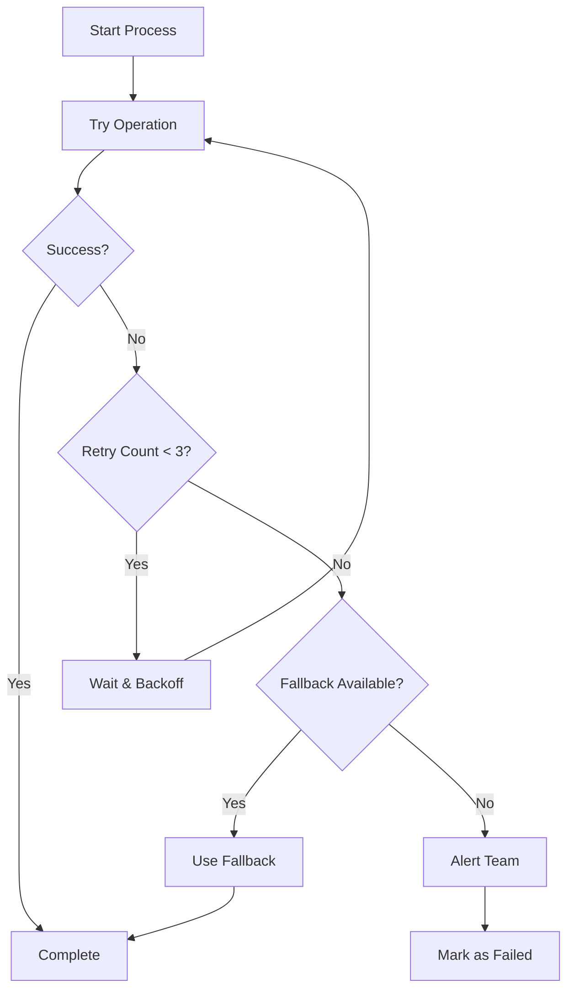
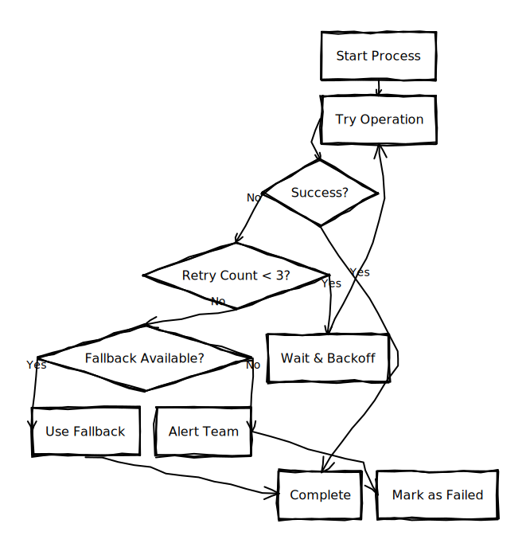
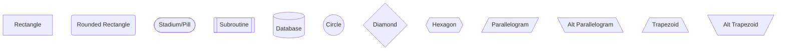
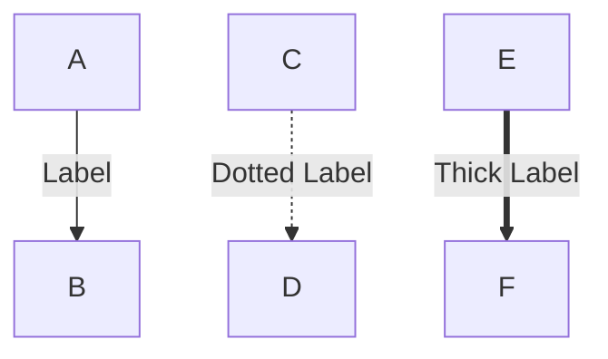

# Exceli-Mermaid 🎨

An offline Python engine that renders Mermaid flowchart scripts with Excalidraw's beautiful hand-drawn aesthetic. Convert your structured diagrams into sketchy, organic-looking visualizations.

## Example Output



**Rendered with Excalidraw style:**



*Features intelligent routing with curved paths, adaptive corner rounding, and hand-drawn aesthetic*

## Features

- 📊 **Mermaid Flowchart Support**: Parse standard Mermaid flowchart syntax
- ✏️ **Excalidraw Style**: Hand-drawn, sketchy rendering with controlled randomness
- 🔀 **Intelligent Edge Routing**: Automatic obstacle avoidance with smooth curved paths
  - Smart attachment point selection (closest edges)
  - Flow-direction aware routing
  - Adaptive A* pathfinding with path optimization
  - Gentle curves on straight segments
- 🖼️ **Multiple Formats**: Export to SVG (vector) and PNG (raster)
- 🔌 **Offline**: No internet connection required, fully local rendering
- 🐍 **Pure Python**: Easy to integrate into your Python projects
- 🎯 **CLI & API**: Use from command line or import as a library
- ⚙️ **Highly Configurable**: Control routing behavior, roughness, colors, and more
- 🎨 **Adaptive Styling**: Corner rounding and arrow sizing adapt to path geometry

## Installation

```bash
pip install excelimermaid
```

Or install from source:

```bash
git clone https://github.com/yourusername/excelimermaid.git
cd excelimermaid
pip install -e .
```

### Claude Code Skill

Install as a Claude Code skill for automatic diagram generation in conversations:

```bash
# Personal skill (available across all projects)
cp -r skill ~/.claude/skills/mermaid-diagram

# Or project-specific (committed to git)
mkdir -p .claude/skills/
cp -r skill .claude/skills/mermaid-diagram
```

Once installed, Claude will automatically use this skill when you ask for flowcharts:
```
"Create a diagram showing the authentication process"
```

See [skill/README.md](skill/README.md) for details.

## Quick Start

### Command Line

```bash
# Render a Mermaid file to SVG
excelimermaid diagram.mmd -o output.svg

# Render to PNG
excelimermaid diagram.mmd -o output.png

# Generate both formats
excelimermaid diagram.mmd -o output --formats svg,png

# Adjust hand-drawn roughness
excelimermaid diagram.mmd -o output.svg --roughness 2.0
```

### Python API

```python
from excelimermaid import render

# Simple usage
mermaid_script = """
flowchart TD
    A[Start] --> B{Decision}
    B -->|Yes| C[Action 1]
    B -->|No| D[Action 2]
    C --> E[End]
    D --> E
"""

render(mermaid_script, output_path="diagram.svg")

# Advanced usage
from excelimermaid import MermaidRenderer

renderer = MermaidRenderer(
    roughness=1.5,           # Hand-drawn intensity (0.0-2.0)
    seed=42,                 # Reproducible randomness
    background_color="white",
    stroke_width=2,
    edge_routing="curved",   # Edge routing: "curved", "straight", "orthogonal"
    smoothness=0.7          # Curve smoothness (0.0-1.0)
)

diagram = renderer.parse(mermaid_script)
diagram.layout(algorithm="hierarchical")
diagram.export("output.svg")
diagram.export("output.png", dpi=300)
```

## Supported Mermaid Syntax

### Node Shapes



### Edge Types

```mermaid
flowchart LR
    A --> B          %% Solid arrow
    C -.-> D         %% Dotted arrow
    E ==> F          %% Thick arrow
    G --- H          %% Solid line (no arrow)
    I -.- J          %% Dotted line
    K === L          %% Thick line
```

### Edge Labels



### Flow Directions

- `TD` or `TB`: Top to bottom
- `BT`: Bottom to top
- `LR`: Left to right
- `RL`: Right to left

## Examples

See the `examples/` directory for sample Mermaid scripts.

## How It Works

1. **Parse**: Converts Mermaid syntax into an Abstract Syntax Tree (AST)
2. **Layout**: Positions nodes using hierarchical graph layout algorithms
3. **Render**: Applies Excalidraw-style rough drawing with controlled randomness
4. **Export**: Generates SVG or converts to PNG

The hand-drawn effect is achieved by:
- Adding controlled random offsets to line segments
- Using multiple overlapping strokes
- Slight variations in shape angles and dimensions
- Hand-written style fonts (Virgil, bundled)

## Configuration

### Renderer Options

- `roughness` (float, 0.0-2.0): Overall hand-drawn intensity
  - **0.5** - Subtle, professional look (recommended for business)
  - **0.8** - Balanced hand-drawn style (recommended default)
  - **1.0** - Normal Excalidraw style (current default)
  - **1.3** - Emphasized sketch
  - **1.5-2.0** - Heavy artistic style
- `seed` (int): Random seed for reproducible output
- `bowing` (float, 0.0-10.0): Curvature of lines
- `stroke_width` (int): Base line thickness
- `font_family` (str): Font for text (default: "Virgil")
- `font_size` (int): Base font size
- `background_color` (str): Background color (default: "white")

### Layout Options

- `algorithm` (str): Layout algorithm ("hierarchical", "force-directed", "grid")
- `node_spacing` (int): Minimum space between nodes
- `rank_spacing` (int): Space between hierarchy levels

### Edge Routing Options

Control how edges are drawn and how they avoid obstacles:

- `edge_routing` (str): Routing style - "curved" (default), "straight", or "orthogonal"
- `avoid_obstacles` (bool): Enable automatic obstacle avoidance (default: True)
- `route_margin` (float): Margin around nodes for collision detection in pixels (default: 5.0)
- `smoothness` (float): Curve smoothness 0.0-1.0 (default: 0.6, higher = more rounded)
- `route_offset` (float): Distance to offset when routing around obstacles in pixels (default: 60.0)

#### Examples

```python
# Straight routing (no curves)
renderer = MermaidRenderer(edge_routing="straight")

# Curved routing with custom smoothness
renderer = MermaidRenderer(
    edge_routing="curved",
    smoothness=0.8,          # Very smooth curves
    route_offset=80.0        # Wider detours around obstacles
)

# Disable obstacle avoidance
renderer = MermaidRenderer(avoid_obstacles=False)
```

#### CLI Examples

```bash
# Straight routing
excelimermaid diagram.mmd -o output.svg --edge-routing straight

# Disable obstacle avoidance
excelimermaid diagram.mmd -o output.svg --no-avoid-obstacles

# Custom routing parameters
excelimermaid diagram.mmd -o output.svg \
    --smoothness 0.8 \
    --route-margin 10.0 \
    --route-offset 80.0
```

For detailed routing configuration documentation, see [ROUTING_CONFIG.md](ROUTING_CONFIG.md).

## Development

### Setup Development Environment

```bash
git clone https://github.com/yourusername/excelimermaid.git
cd excelimermaid
pip install -e ".[dev]"
```

### Run Tests

```bash
pytest
pytest --cov=excelimermaid  # With coverage
```

### Code Formatting

```bash
black src/ tests/
mypy src/
```

## Architecture

See [DESIGN.md](DESIGN.md) for detailed architecture and design decisions.

## Roadmap

- [x] Phase 1: Core flowchart shapes and basic rendering
- [ ] Phase 2: Subgraphs, styling, extended shapes
- [ ] Phase 3: Sequence diagrams, class diagrams
- [ ] Phase 4: Excalidraw JSON export for bidirectional editing
- [ ] Phase 5: Animation support, theming system

## Contributing

Contributions are welcome! Please feel free to submit a Pull Request.

## License

MIT License - See LICENSE file for details

## Acknowledgments

- [Mermaid.js](https://mermaid.js.org/) - Diagramming syntax
- [Excalidraw](https://excalidraw.com/) - Hand-drawn aesthetic inspiration
- [Rough.js](https://roughjs.com/) - Rough drawing algorithm concepts

## Related Projects

- [Mermaid.js](https://mermaid.js.org/) - JavaScript-based Mermaid renderer
- [Excalidraw](https://excalidraw.com/) - Virtual whiteboard for hand-drawn diagrams
- [Kroki](https://kroki.io/) - Unified API for diagram generation
