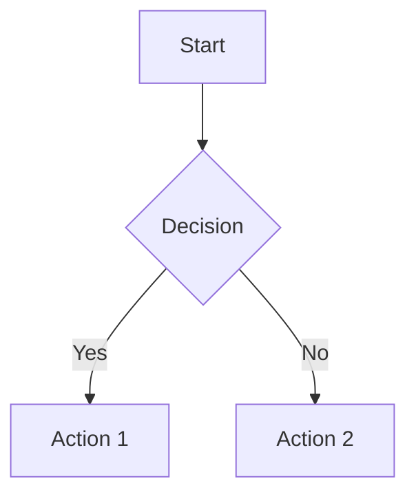

# Exceli-Mermaid: Design Document

## Overview
An offline Python engine that renders Mermaid flowchart scripts into diagrams with Excalidraw's hand-drawn, sketchy aesthetic. Supports PNG and SVG output formats.

## Architecture

### 1. Core Components

```
┌─────────────────────────────────────────────────┐
│              Exceli-Mermaid Engine              │
├─────────────────────────────────────────────────┤
│                                                 │
│  ┌───────────────┐      ┌──────────────────┐  │
│  │ Mermaid Parser│─────▶│  Graph Builder   │  │
│  └───────────────┘      └──────────────────┘  │
│                                 │              │
│                                 ▼              │
│                    ┌──────────────────────┐   │
│                    │   Layout Engine      │   │
│                    │  (Node Positioning)  │   │
│                    └──────────────────────┘   │
│                                 │              │
│                                 ▼              │
│                    ┌──────────────────────┐   │
│                    │  Rendering Engine    │   │
│                    │ (Excalidraw Style)   │   │
│                    └──────────────────────┘   │
│                                 │              │
│                    ┌────────────┴────────┐    │
│                    ▼                     ▼    │
│            ┌──────────────┐      ┌──────────┐│
│            │ SVG Exporter │      │PNG Export││
│            └──────────────┘      └──────────┘│
└─────────────────────────────────────────────────┘
```

### 2. Component Details

#### 2.1 Mermaid Parser
**Purpose**: Parse Mermaid flowchart syntax into an intermediate representation

**Input**: Mermaid script string


**Output**: Abstract Syntax Tree (AST)
```python
{
    'type': 'flowchart',
    'direction': 'TD',
    'nodes': [
        {'id': 'A', 'text': 'Start', 'shape': 'rectangle'},
        {'id': 'B', 'text': 'Decision', 'shape': 'diamond'},
        {'id': 'C', 'text': 'Action 1', 'shape': 'rectangle'},
        {'id': 'D', 'text': 'Action 2', 'shape': 'rectangle'}
    ],
    'edges': [
        {'from': 'A', 'to': 'B'},
        {'from': 'B', 'to': 'C', 'label': 'Yes'},
        {'from': 'B', 'to': 'D', 'label': 'No'}
    ]
}
```

**Libraries**:
- Custom regex-based parser or
- Leverage existing: `pyparsing` or `lark-parser`

#### 2.2 Graph Builder
**Purpose**: Convert AST into a graph data structure

**Responsibilities**:
- Create node objects with properties (text, shape, style)
- Create edge objects with properties (direction, label)
- Validate graph structure

**Data Structure**:
```python
class Node:
    id: str
    text: str
    shape: ShapeType  # rectangle, diamond, circle, etc.
    position: Optional[Point]  # Filled by layout engine

class Edge:
    source: Node
    target: Node
    label: Optional[str]
    points: List[Point]  # Control points for curved edges
```

#### 2.3 Layout Engine
**Purpose**: Calculate positions for nodes and routing for edges

**Algorithm Options**:
1. **Sugiyama Framework** (Hierarchical): Best for flowcharts
   - Layer assignment
   - Node ordering within layers
   - Coordinate assignment

2. **Force-Directed** (Fruchterman-Reingold): For general graphs

3. **Simple Grid-Based**: Quick implementation for MVP

**Output**: Graph with positioned nodes and edge paths

**Libraries**:
- `networkx` for graph algorithms
- `grandalf` for Sugiyama layout
- Custom implementation for simple cases

#### 2.4 Rendering Engine (Excalidraw Style)
**Purpose**: Render positioned graph with hand-drawn aesthetic

**Excalidraw Style Features**:
1. **Rough edges**: Use `roughjs` algorithm (Python port)
   - Randomized line segments
   - Slight wobble and imperfections

2. **Hand-drawn shapes**:
   - Rectangles: Slightly irregular corners
   - Diamonds: Non-perfect angles
   - Circles: Slightly elliptical
   - Arrows: Hand-drawn arrow heads

3. **Typography**:
   - Hand-written style fonts
   - Slight baseline variation

4. **Colors**: Excalidraw default palette
   - Background: #FFFFFF
   - Shapes: #000000 stroke, fills optional
   - Highlights: Pastel colors

**Implementation**:
```python
class ExcalidrawRenderer:
    def draw_rectangle(self, x, y, width, height, roughness=1.0):
        # Generate rough path with controlled randomness
        pass

    def draw_diamond(self, center_x, center_y, size, roughness=1.0):
        pass

    def draw_arrow(self, points, roughness=1.0):
        # Rough line with arrow head
        pass
```

**Key Parameters**:
- `roughness`: 0.0 (smooth) to 2.0 (very rough), default 1.0
- `seed`: Random seed for reproducible rendering

#### 2.5 SVG Exporter
**Purpose**: Generate SVG file from rendered elements

**Features**:
- Vector-based output
- Scalable without quality loss
- Embeds fonts or uses web fonts
- Proper viewBox for responsive scaling

**Libraries**:
- `svgwrite` for SVG generation
- Direct XML generation for more control

#### 2.6 PNG Exporter
**Purpose**: Generate raster PNG from SVG or direct rendering

**Approach Options**:
1. **SVG → PNG**: Render SVG to PNG using browser-less renderer
   - Use `cairosvg` or `selenium` + headless Chrome

2. **Direct Canvas Rendering**: Use `Pillow` (PIL) for direct raster rendering
   - More control but requires duplicating rendering logic

**Libraries**:
- `cairosvg`: Best for SVG → PNG conversion
- `Pillow`: For direct raster rendering
- `pyvips`: High-performance alternative

## 3. Supported Mermaid Features (MVP)

### Phase 1 - Core Flowchart
- [x] Node shapes:
  - Rectangle `[Text]`
  - Rounded rectangle `(Text)`
  - Diamond `{Text}`
  - Circle `((Text))`

- [x] Edge types:
  - Solid arrow `-->`
  - Dotted arrow `-.->`
  - Thick arrow `==>`

- [x] Edge labels: `-->|Label|`

- [x] Flow directions: `TD`, `TB`, `LR`, `RL`

### Phase 2 - Extended Features
- [ ] Subgraphs
- [ ] Styling (colors, stroke width)
- [ ] More shapes (hexagon, parallelogram, etc.)
- [ ] Multi-line text

## 4. File Structure

```
excelimermaid/
├── README.md
├── DESIGN.md
├── requirements.txt
├── setup.py
├── examples/
│   ├── basic_flowchart.mmd
│   ├── decision_tree.mmd
│   └── complex_flow.mmd
├── src/
│   └── excelimermaid/
│       ├── __init__.py
│       ├── parser/
│       │   ├── __init__.py
│       │   ├── mermaid_parser.py
│       │   └── ast_builder.py
│       ├── graph/
│       │   ├── __init__.py
│       │   ├── models.py          # Node, Edge classes
│       │   └── builder.py
│       ├── layout/
│       │   ├── __init__.py
│       │   ├── base.py             # Abstract layout
│       │   ├── hierarchical.py     # Sugiyama
│       │   └── simple_grid.py      # Simple grid layout
│       ├── renderer/
│       │   ├── __init__.py
│       │   ├── excalidraw_style.py # Rough drawing algorithms
│       │   ├── shapes.py           # Shape drawing
│       │   └── text.py             # Text rendering
│       ├── export/
│       │   ├── __init__.py
│       │   ├── svg_exporter.py
│       │   └── png_exporter.py
│       └── cli.py                   # Command-line interface
└── tests/
    ├── test_parser.py
    ├── test_layout.py
    └── test_renderer.py
```

## 5. API Design

### 5.1 Python API
```python
from excelimermaid import render

# Simple usage
render(
    mermaid_script="flowchart TD\n    A-->B",
    output_path="diagram.svg",
    format="svg"
)

# Advanced usage with options
from excelimermaid import MermaidRenderer

renderer = MermaidRenderer(
    roughness=1.5,          # Hand-drawn intensity
    seed=42,                # Reproducible randomness
    font_family="Virgil",   # Excalidraw default font
    background_color="#FFFFFF"
)

diagram = renderer.parse(mermaid_script)
diagram.layout(algorithm="hierarchical")
diagram.export("output.svg")
diagram.export("output.png", dpi=300)
```

### 5.2 CLI
```bash
# Basic usage
excelimermaid input.mmd -o output.svg

# Specify format
excelimermaid input.mmd -o output.png --format png

# With options
excelimermaid input.mmd -o output.svg \
  --roughness 2.0 \
  --seed 12345 \
  --dpi 300 \
  --background transparent

# Output both formats
excelimermaid input.mmd -o output --formats svg,png
```

## 6. Dependencies

### Core Libraries
```
- pyparsing >= 3.0.0      # Parser
- networkx >= 3.0         # Graph algorithms
- svgwrite >= 1.4         # SVG generation
- cairosvg >= 2.7         # PNG export
- Pillow >= 10.0          # Image processing
- numpy >= 1.24           # Numerical operations
```

### Optional
```
- grandalf >= 0.8         # Advanced layout algorithms
- click >= 8.0            # CLI framework
```

## 7. Rendering Algorithm Details

### Rough.js Style Algorithm (Python Port)

**Roughness Parameters**:
- `roughness`: Overall roughness multiplier
- `bowing`: Curvature of lines (0-10)
- `maxRandomnessOffset`: Maximum pixel offset

**Line Drawing**:
```python
def rough_line(p1, p2, roughness=1.0, bowing=1.0):
    """Draw a rough line from p1 to p2"""
    # Split line into segments
    length = distance(p1, p2)
    segments = int(length / 10) + 2

    points = []
    for i in range(segments):
        t = i / (segments - 1)
        x = lerp(p1.x, p2.x, t)
        y = lerp(p1.y, p2.y, t)

        # Add perpendicular offset
        if 0 < i < segments - 1:
            offset = random.gauss(0, roughness * 2)
            angle = atan2(p2.y - p1.y, p2.x - p1.x) + pi/2
            x += cos(angle) * offset
            y += sin(angle) * offset

        points.append((x, y))

    # Draw path through points
    return create_path(points)
```

### Shape Templates

**Rectangle**:
- 4 rough lines with slight corner overshoot
- Optional fill with hatching pattern

**Diamond**:
- 4 lines forming diamond, each with roughness
- Slight angle variation (±2 degrees)

**Circle**:
- Multiple overlapping rough ellipses
- Slight axis ratio variation (0.95-1.05)

**Arrow**:
- Rough line body
- Triangle or chevron arrowhead with roughness

## 8. Testing Strategy

### Unit Tests
- Parser: Test Mermaid syntax parsing
- Layout: Verify node positioning logic
- Renderer: Check shape generation

### Integration Tests
- End-to-end: Mermaid → SVG/PNG
- Visual regression: Compare outputs with reference images

### Test Examples
```python
def test_basic_flowchart():
    script = """
    flowchart TD
        A[Start] --> B[End]
    """
    result = render(script, format='svg')
    assert result contains valid SVG
    assert result contains 2 rectangles
    assert result contains 1 arrow
```

## 9. Performance Considerations

- **Parsing**: Should be fast, cache AST if possible
- **Layout**: Most expensive operation
  - Use efficient algorithms (O(n log n) or better)
  - Consider caching layouts for similar graphs
- **Rendering**:
  - SVG: Fast, just XML generation
  - PNG: Bottleneck is rasterization
    - Use high-quality but fast renderers
    - Consider parallel processing for batch operations

## 10. Future Enhancements

### Phase 3 - More Diagram Types
- Sequence diagrams
- Class diagrams
- State diagrams
- Gantt charts

### Phase 4 - Interactivity
- Export to Excalidraw JSON format
- Allow editing in Excalidraw
- Bidirectional conversion

### Phase 5 - Advanced Features
- Animation export (SVG SMIL or GIF)
- Theming system
- Custom shape plugins
- Web API / HTTP server

## 11. Open Questions

1. **Font handling**:
   - Bundle Virgil font (Excalidraw's font)?
   - Fallback to similar fonts?
   - Allow custom fonts?

2. **Mermaid compatibility**:
   - Full Mermaid.js compatibility or subset?
   - How to handle unsupported features?

3. **Rough.js algorithm**:
   - Port exact algorithm or create similar?
   - License compatibility?

4. **Performance targets**:
   - Acceptable rendering time for 100-node graph?
   - Memory constraints?

## 12. Success Metrics

- Parse all common flowchart patterns
- Generate recognizable Excalidraw-style output
- Render 50-node flowchart in < 5 seconds
- SVG output < 500KB for typical diagrams
- PNG quality comparable to Mermaid.js + manual Excalidraw styling
