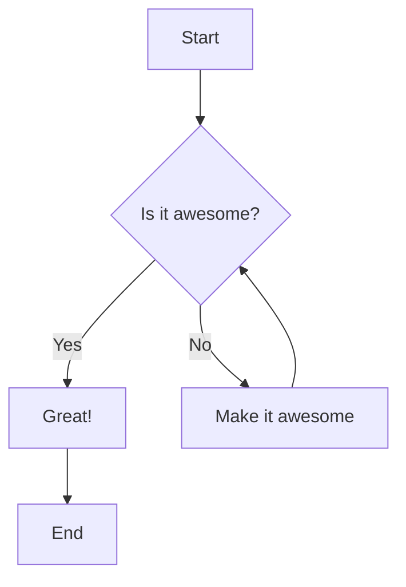
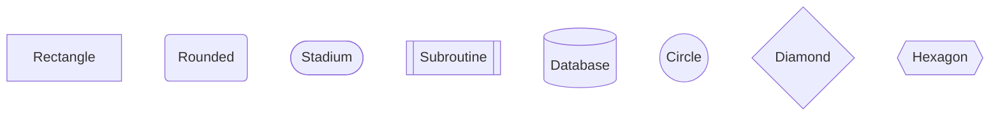
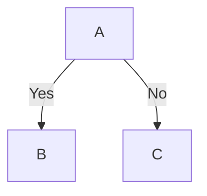

# Quick Start Guide

Get up and running with Exceli-Mermaid in 5 minutes!

## Installation

```bash
cd /home/ubuntu/excelimermaid
pip install -e .
```

## Your First Diagram

### 1. Create a Mermaid file

Create `my_diagram.mmd`:


### 2. Render to SVG

```bash
excelimermaid my_diagram.mmd -o output.svg
```

That's it! Open `output.svg` in your browser or image viewer.

### 3. Try PNG

```bash
excelimermaid my_diagram.mmd -o output.png --dpi 300
```

## Customize the Style

### Adjust Roughness

More sketchy:
```bash
excelimermaid my_diagram.mmd -o output.svg --roughness 2.0
```

Less sketchy:
```bash
excelimermaid my_diagram.mmd -o output.svg --roughness 0.5
```

### Reproducible Output

Use a seed for consistent results:
```bash
excelimermaid my_diagram.mmd -o output.svg --seed 42
```

### Generate Both Formats

```bash
excelimermaid my_diagram.mmd -o output --formats svg,png
```

This creates:
- `output.svg`
- `output.png`

## Python API

### Simple

```python
from excelimermaid import render

script = """
flowchart TD
    A[Start] --> B[End]
"""

render(script, "output.svg")
```

### Advanced

```python
from excelimermaid import MermaidRenderer

# Configure renderer
renderer = MermaidRenderer(
    roughness=1.5,      # Hand-drawn intensity
    seed=42,            # Reproducible randomness
    node_spacing=100,   # Space between nodes
    rank_spacing=120    # Space between levels
)

# Parse, layout, and export
diagram = renderer.parse(script)
diagram.layout()
diagram.export("output.svg")
diagram.export("output.png", dpi=300)
```

## Examples

Try the included examples:

```bash
# Basic flowchart
excelimermaid examples/basic_flowchart.mmd -o basic.svg

# Decision tree
excelimermaid examples/decision_tree.mmd -o decision.svg

# Complex flow (left-to-right)
excelimermaid examples/complex_flow.mmd -o complex.svg
```

## Common Mermaid Syntax

### Node Shapes



### Edge Types

```mermaid
flowchart LR
    A --> B           %% Solid arrow
    C -.-> D          %% Dotted arrow
    E ==> F           %% Thick arrow
    G --- H           %% Line (no arrow)
```

### Edge Labels



### Directions

```bash
# Top to bottom (default)
flowchart TD

# Left to right
flowchart LR

# Right to left
flowchart RL

# Bottom to top
flowchart BT
```

## Tips

1. **Use Comments**: Add `%%` for comments
   ```mermaid
   flowchart TD
       %% This is a comment
       A --> B
   ```

2. **Check File Size**: SVG files are smaller and scalable
   - Use SVG for web/documents
   - Use PNG for presentations (300 DPI recommended)

3. **Experiment with Roughness**:
   - `0.5` - Subtle sketchy effect
   - `1.0` - Default Excalidraw look
   - `1.5` - More hand-drawn
   - `2.0` - Very rough

4. **Use Seeds for Consistency**: When you like a particular look, note the seed value to recreate it

## Troubleshooting

### Command not found

```bash
# Reinstall the package
pip install -e .
```

### Import errors

```bash
# Install all dependencies
pip install -e ".[dev]"
```

### PNG generation fails

Make sure `cairosvg` is installed:
```bash
pip install cairosvg
```

## Next Steps

- Read [DESIGN.md](DESIGN.md) for architecture details
- See [IMPLEMENTATION_STATUS.md](IMPLEMENTATION_STATUS.md) for what's implemented
- Check [README.md](README.md) for comprehensive documentation
- Run tests: `pytest tests/`
- Explore the source code in `src/excelimermaid/`

## Get Help

```bash
# CLI help
excelimermaid --help

# Run tests
pytest

# Check coverage
pytest --cov=excelimermaid
```

Happy diagramming! 🎨
