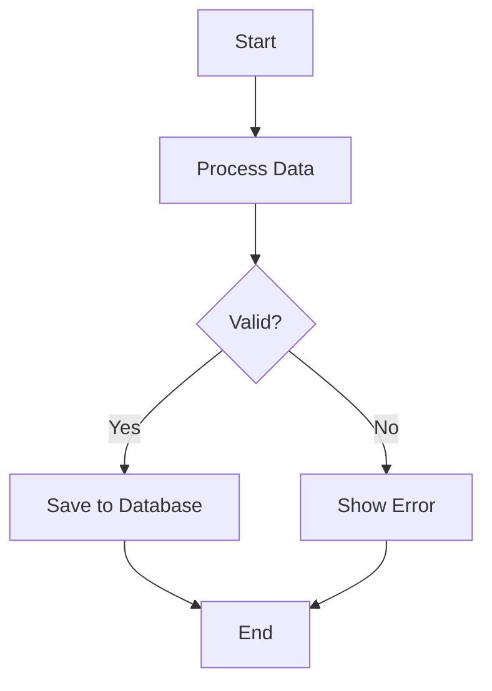

# Mermaid Diagram - Claude Code Skill

A Claude Code skill for generating beautiful hand-drawn flowchart diagrams from Mermaid syntax using Excalidraw aesthetic.

## Installation

### Option 1: Personal Skill (Available Across All Projects)

```bash
# Copy skill to your personal Claude skills directory
mkdir -p ~/.claude/skills/
cp -r skill ~/.claude/skills/mermaid-diagram
```

### Option 2: Project-Specific Skill

```bash
# Copy skill to project's .claude directory (committed to git)
mkdir -p .claude/skills/
cp -r skill .claude/skills/mermaid-diagram
```

### Option 3: Install Parent Package

The skill requires the excelimermaid package:

```bash
# Install from the parent directory
cd ..
pip install -e .
```

## Usage with Claude Code

Once installed, the skill is available in your Claude Code conversations:

### Automatic Invocation

Claude will automatically use this skill when you ask for diagrams:

```
User: "Create a flowchart showing the authentication process"

Claude: I'll create an authentication flow diagram using the mermaid-diagram skill.
[Creates auth_flow.mmd with Mermaid syntax]
[Generates auth_flow.svg using excelimermaid]
[Shows the result]
```

### Manual Invocation

You can also invoke the skill manually:

```
/mermaid-diagram workflow.svg
```

This tells Claude to use the skill with the specified output filename.

## Features

✨ **Hand-drawn Style** - Excalidraw aesthetic with configurable roughness
🎯 **Intelligent Routing** - Smart edge routing with obstacle avoidance
🔄 **Path Optimization** - 80-90% waypoint reduction for cleaner paths
📊 **Multiple Formats** - SVG (vector) and PNG (raster) output
🎨 **Customizable** - Control roughness, routing style, and direction
⚡ **Fast** - Offline processing, no API calls needed

## Skill Structure

```
skill/
├── SKILL.md                        # Main skill definition (REQUIRED)
└── examples/
    └── sample-workflow.md          # Example usage
```

The skill follows the [Agent Skills](https://agentskills.io) standard used by Claude Code.

## What Claude Can Do

When the skill is active, Claude can:

1. **Write Mermaid syntax** - Create `.mmd` files with proper flowchart syntax
2. **Generate diagrams** - Run `python -m excelimermaid.cli` to create SVG/PNG
3. **Customize styling** - Adjust roughness, routing, and format
4. **Iterate on feedback** - Modify diagrams based on your preferences

## Supported Mermaid Features

- **Node shapes**: Rectangles, diamonds, circles, databases, etc.
- **Edge types**: Solid, dotted, thick arrows and lines
- **Edge labels**: Decision branches with Yes/No labels
- **Flow directions**: Top-down (TD), left-right (LR), etc.
- **Complex routing**: Loops, multiple branches, parallel paths

See `SKILL.md` for complete syntax reference and examples.

## Configuration

### Roughness Levels

- `0.5` - Subtle, professional (business documents)
- `0.8` - Balanced hand-drawn style
- `1.0` - Normal Excalidraw style (default)
- `1.5-2.0` - Heavy artistic style

### Edge Routing

- `curved` - Smooth curved paths (default)
- `straight` - Direct lines
- `orthogonal` - 90° angles

### Output Formats

- `svg` - Vector format (scalable, small file size)
- `png` - Raster format (for embedding in documents)

## Examples

See the `examples/` directory for sample usage patterns.

Quick example:



Generates a beautiful hand-drawn flowchart with intelligent routing and adaptive styling.

## Troubleshooting

### Skill Not Found

Ensure the skill is installed in the correct location:
- Personal: `~/.claude/skills/mermaid-diagram/SKILL.md`
- Project: `.claude/skills/mermaid-diagram/SKILL.md`

### Import Errors

Make sure excelimermaid is installed:
```bash
python -c "import excelimermaid" || pip install -e /path/to/excelimermaid
```

### Permission Issues

Claude needs `Write` and `Bash` permissions (configured in SKILL.md frontmatter):
```yaml
allowed-tools: Write, Bash, Read
```

## How It Works

1. **Skill Discovery**: Claude Code finds skills in `~/.claude/skills/` and `.claude/skills/`
2. **Automatic Invocation**: Claude decides to use the skill based on the description
3. **Tool Access**: Skill has permission to use Write (create .mmd), Bash (run CLI), and Read
4. **Execution**: Claude follows SKILL.md instructions to generate diagrams
5. **Result**: SVG/PNG diagrams are created in your project directory

## Documentation

- **SKILL.md** - Complete skill instructions for Claude
- **examples/** - Sample usage patterns
- **README.md** - This file (installation and usage)

## License

MIT License - See ../LICENSE for details

## Credits

Built on [excelimermaid](https://github.com/yourusername/excelimermaid) - an offline Python engine for Mermaid to Excalidraw conversion.
