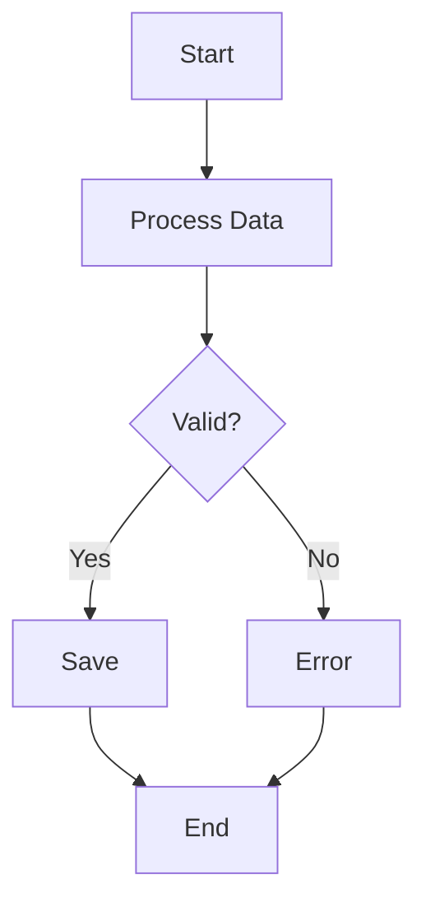
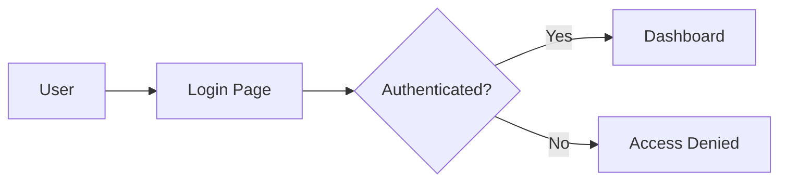
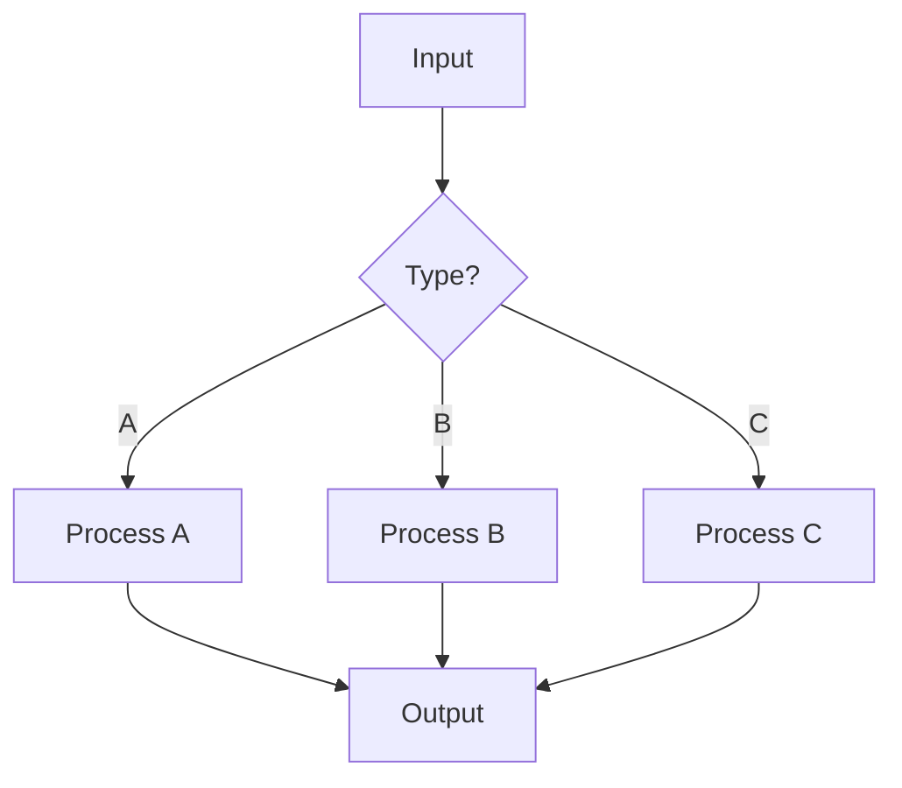
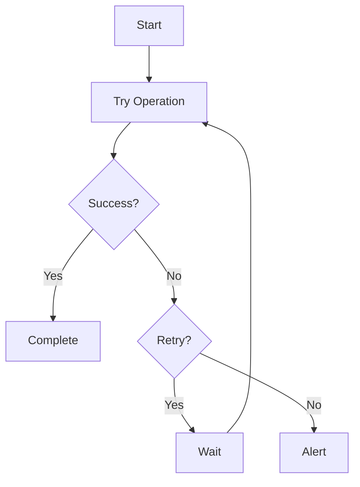
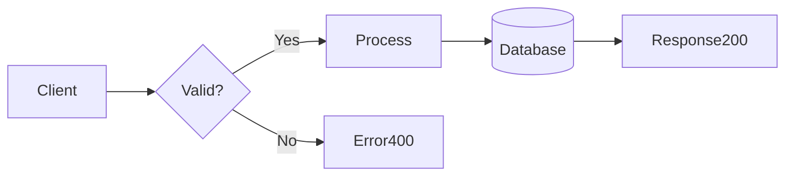
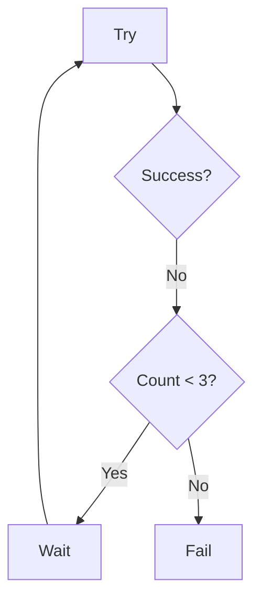
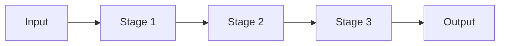

# Mermaid Diagram Generator

Generate hand-drawn Excalidraw-style diagrams from Mermaid flowchart syntax.

## When to Use This Skill

Use this skill when:
- User requests a flowchart or process diagram
- User wants to visualize a workflow or decision tree
- User provides Mermaid syntax and wants it rendered
- User describes a process that should be diagrammed

## How to Use

1. **Create the Mermaid file** - Write the flowchart syntax to a `.mmd` file
2. **Generate the diagram** - Run the excelimermaid CLI to create the SVG/PNG
3. **Show the result** - Display the generated diagram path

## Supported Mermaid Syntax

### Node Shapes
- `[Text]` - Rectangle
- `(Text)` - Rounded rectangle
- `{Text}` - Diamond (decision)
- `[(Text)]` - Database cylinder
- `((Text))` - Circle
- `[[Text]]` - Subroutine

### Edge Types
- `-->` - Solid arrow
- `-.->` - Dotted arrow
- `==>` - Thick arrow
- `---` - Line without arrow
- `-.-` - Dotted line
- `===` - Thick line

### Edge Labels
- `-->|Label|` - Arrow with label
- `-.->|Label|` - Dotted arrow with label

### Flow Directions
- `flowchart TD` - Top to bottom (default)
- `flowchart LR` - Left to right
- `flowchart RL` - Right to left
- `flowchart BT` - Bottom to top

## Command to Generate Diagrams

```bash
# Basic usage
python -m excelimermaid.cli input.mmd --output output.svg

# Custom roughness (0.5=subtle, 1.0=normal, 2.0=heavy)
python -m excelimermaid.cli input.mmd --output output.svg --roughness 0.8

# PNG format
python -m excelimermaid.cli input.mmd --output output.png

# With debug logging
python -m excelimermaid.cli input.mmd --output output.svg --debug
```

## Styling Options

**Roughness levels:**
- `0.5` - Subtle, professional (business documents)
- `0.8` - Balanced hand-drawn style
- `1.0` - Normal Excalidraw style (default)
- `1.5-2.0` - Heavy artistic style

**Routing styles:**
- `--edge-routing curved` - Smooth curved paths (default)
- `--edge-routing straight` - Direct lines
- `--edge-routing orthogonal` - 90° angles

## Example Workflow

When user requests a diagram:

1. **Understand requirements** - Ask clarifying questions if needed
2. **Write Mermaid syntax** - Create `.mmd` file with proper syntax
3. **Generate diagram** - Run CLI command with appropriate options
4. **Verify output** - Check that SVG/PNG was created successfully
5. **Present result** - Show the diagram path and offer to adjust styling

## Example Templates

### Simple Workflow


### Authentication Flow


### Decision Tree


### Error Handling


## Tips for Great Diagrams

1. **Use descriptive labels** - Clear node names improve readability
2. **Choose appropriate direction** - LR for sequences, TD for hierarchies
3. **Label decision branches** - Use `|Yes|` and `|No|` on diamond edges
4. **Use database cylinders** - `[()]` for database nodes
5. **Keep it simple** - Too many nodes reduce clarity
6. **Match roughness to context** - Professional (0.5) vs casual (1.0+)

## Common Patterns

**API Request Flow:**


**Retry Pattern:**


**Pipeline:**


## Troubleshooting

**Syntax Errors:**
- Check for matching brackets `[]`, `{}`, `()`
- Verify arrow syntax `-->` not `->` or `-->`
- Ensure flowchart direction is specified

**Rendering Issues:**
- Verify excelimermaid is installed: `python -c "import excelimermaid"`
- Check output path is writable
- Use `--debug` flag to see detailed logs

**Style Adjustments:**
- Too wobbly? Reduce `--roughness` to 0.5-0.8
- Too straight? Increase `--roughness` to 1.3-1.5
- Wrong routing? Try different `--edge-routing` modes

## Features

The excelimermaid engine provides:
- ✨ Intelligent edge routing with obstacle avoidance
- 🎨 Adaptive corner rounding (major corners only)
- 🔄 Path optimization (80-90% waypoint reduction)
- ➡️ Adaptive arrow sizing based on path length
- 🎯 Distance-based attachment point selection
- 🧭 Flow-direction aware routing
- 📏 Gentle curves on straight segments

All diagrams are rendered with professional hand-drawn aesthetics that match Excalidraw's style.
