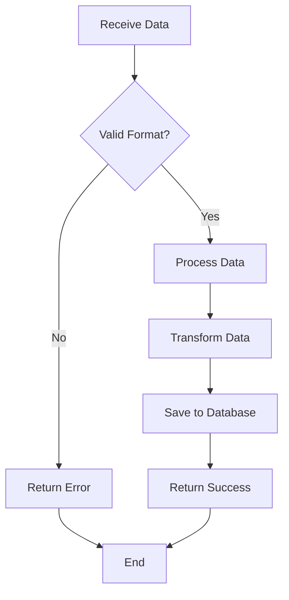

# Example: Creating a Workflow Diagram

## User Request
"Can you create a diagram showing a simple data processing workflow?"

## Claude's Response

I'll create a data processing workflow diagram for you.

First, let me write the Mermaid syntax:

**workflow.mmd:**


Now I'll generate the diagram:

```bash
python -m excelimermaid.cli workflow.mmd --output workflow.svg --roughness 0.8
```

✅ **Diagram generated:** `workflow.svg`

The diagram shows:
- Data validation with a decision point
- Two paths: success (process → transform → save) and error
- Hand-drawn Excalidraw style with balanced roughness (0.8)
- Intelligent routing with smooth curved connections

You can view the SVG file or I can adjust the styling if you'd like it more subtle (0.5) or more artistic (1.5).

---

## Alternative: More Professional Style

If you prefer a more professional look for business documentation:

```bash
python -m excelimermaid.cli workflow.mmd --output workflow-professional.svg --roughness 0.5
```

This creates a subtler hand-drawn effect suitable for formal presentations.
